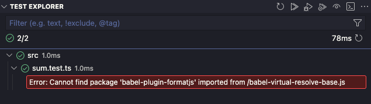

# Vitest + Format.JS babel plugin bug in Vitest VS Code extension

Setup with these guides:

1. https://vitejs.dev/guide/ (react+ts)
2. https://vitest.dev/guide/
3. https://formatjs.io/docs/getting-started/installation
4. https://formatjs.io/docs/getting-started/installation#babel
5. https://www.npmjs.com/package/@vitejs/plugin-react#babel

Reproduction:

1. Run tests in Vitest VS Code extension. They should run fine. Re-running and refressing works.
2. Make any change in `sum.test.ts` and save.
3. The extension throws error `Error: Cannot find package 'babel-plugin-formatjs' imported from /babel-virtual-resolve-base.js`

   

4. This breaks some features of the extension. Tests cannot be run from the gutter, for example.
5. Refreshing tests or running all tests gets rid of the error and allows the extension to function correctly, up until the next save in any test file.
6. When running tests from the command line, this doesn't happen.
